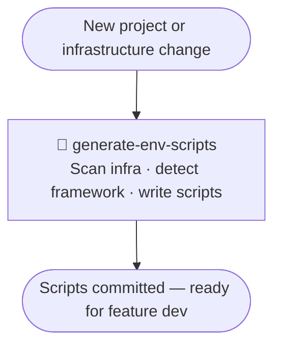
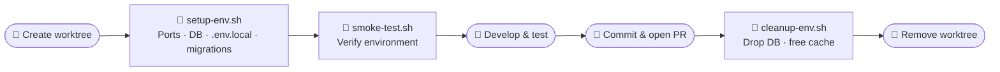

# setup-isolated-env

A Claude Code plugin that generates isolation scripts for parallel feature development using git worktrees — unique ports, isolated databases, and independent environment configs per branch.

**Author:** Joel Chan · **Version:** 0.2.0

---

## The Problem

Working on multiple features at the same time breaks things:

- Port `3000` is already taken by main — where does the feature branch run?
- Feature A's test data corrupts Feature B's database
- Switching branches means manually juggling `.env` files

---

## The Solution

This plugin generates **three shell scripts** tailored to your project's infrastructure. Once generated, spinning up a new isolated environment takes one command.

```
Each worktree gets:
  ├── Unique ports          (e.g. 3010, 3011)
  ├── Isolated database     (e.g. myapp_feature_auth_db)
  ├── Independent .env.local
  └── Separate git worktree (.worktrees/feature-auth/)
```

---

## Skills

| Skill | What it does | When |
|-------|-------------|------|
| `generate-env-scripts` | Scans infrastructure, writes the scripts | Once per project; re-run when adding services or changing infra |
| `activate-worktree-env` | Runs the scripts to provision and verify a new environment | Each time a worktree is created |

---

## Flow 1 — Project Setup

> Skill: `setup-isolated-env:generate-env-scripts`



**What the skill writes:**

| Script | Purpose |
|--------|---------|
| `setup-env.sh` | Allocate ports, write `.env.local`, create DB, run migrations |
| `smoke-test.sh` | Verify connectivity after setup |
| `cleanup-env.sh` | Drop DB and free resources before worktree removal |

Re-run `generate-env-scripts` when you add a new service (database, cache, queue) or change infrastructure.

---

## Flow 2 — Feature Development

> Steps marked 🤖 are handled by `setup-isolated-env:activate-worktree-env`



**Step-by-step:**

```bash
# 1. Create worktree (developer)
git worktree add .worktrees/my-feature -b my-feature
cd .worktrees/my-feature

# 2. Provision environment (skill: activate-worktree-env)
../../<worktree_scripts>/setup-env.sh
../../<worktree_scripts>/smoke-test.sh

# 3. Develop, test, commit, open PR (developer)

# 4. Clean up (developer — run BEFORE removing worktree)
../../<worktree_scripts>/cleanup-env.sh my-feature
git worktree remove .worktrees/my-feature
```

> `cleanup-env.sh` frees DB and cache resources. It does **not** remove the worktree — that's a separate `git worktree remove`.

---

## Script Details

### `setup-env.sh`

Runs from inside the worktree. The worktree must already exist.

```
① Check prerequisites (infra running, .env template present)
② Detect branch name (fails if run on main/master)
③ Verify worktree exists
④ Allocate unique ports and cache slot
⑤ Copy .env template → .env.local, write PORT / DATABASE_URL / etc.
⑥ Create isolated database
⑦ Run migrations
```

Port allocation:
```
main:            PORT=3000, API_PORT=3001
1st worktree:    PORT=3010, API_PORT=3011
2nd worktree:    PORT=3020, API_PORT=3021
```

### `smoke-test.sh`

Runs from inside the worktree. Auto-detects environment from `$PWD`.

```
① PORT and DATABASE_URL are set in .env.local
② Port is not already in use
③ Database is reachable
④ Infrastructure services are running
```

### `cleanup-env.sh`

Runs from project root before `git worktree remove`.

```
① Warn if worktree has uncommitted changes
② Drop isolated database
③ Free cache namespace (Redis DB / key prefix)
```

---

## Infrastructure & Framework Support

| Infrastructure | DB isolation | Cache isolation |
|---------------|-------------|----------------|
| Docker Compose | Separate database | Redis DB 0–15 |
| Supabase local | Separate database | Redis DB 0–15 |
| Kubernetes | Separate database | Cache key prefix |
| Managed DB (RDS etc.) | Manual / API | Cache key prefix |

| Framework | Port config location |
|-----------|---------------------|
| Vite | `vite.config.ts` → `server.port: Number(process.env.PORT)` |
| Next.js | Reads `PORT` automatically |
| Express / Elysia / Bun | `process.env.PORT` in server entrypoint |

---

## Plugin Structure

```
setup-isolated-env/
├── .claude-plugin/plugin.json
├── CLAUDE.md
├── README.md
└── skills/
    ├── generate-env-scripts/
    │   ├── SKILL.md
    │   ├── scripts/
    │   │   ├── checklist.sh          ← detects infrastructure
    │   │   └── detect-framework.sh   ← detects framework type
    │   └── assets/                   ← reference templates (not copied directly)
    │       ├── setup-env.sh
    │       ├── smoke-test.sh
    │       ├── cleanup-env.sh
    │       └── WORKTREE.md-template.md
    └── activate-worktree-env/
        └── SKILL.md
```
