# setup-isolated-env

A Claude Code plugin that guides projects to create automation scripts for isolated development environments using git worktrees. Enables parallel feature development with zero port conflicts, zero data pollution, and zero setup friction.

**Author:** Joel Chan
**Version:** 0.2.0

---

## The Problem

Working on multiple features simultaneously breaks things:

- Port `3000` is taken by your main branch — where does the feature branch run?
- Feature A seeded test data that corrupts Feature B's database
- You context-switch between branches and forget which `.env` is active
- New team members spend hours setting up a second environment

---

## The Solution

This plugin guides you to generate **three shell scripts** that automate all of this. Once generated, any developer (or Claude) can spin up a fully isolated environment in one command.

```
Each worktree environment gets:
  ├── Unique port range      (e.g., 3010, 3011, 3012)
  ├── Isolated database      (e.g., myapp_feature_auth_db)
  ├── Independent .env.local (generated from your template)
  └── Separate git worktree  (.worktrees/feature-auth/)
```

---

## Skills

This plugin provides two skills with distinct responsibilities:

| Skill | Purpose | When |
|-------|---------|------|
| `generate-env-scripts` | Scan infrastructure → **write** the scripts | Once per project (or when adding new services) |
| `activate-worktree-env` | **Run** the scripts → provision & verify environment | Each time a new worktree is created |

---

## Development Flow

```mermaid
flowchart TD
    A([Project needs parallel dev\nor adds a new service]) --> B

    subgraph ONCE ["📋 ONE-TIME SETUP — generate-env-scripts skill"]
        B[Run checklist.sh\nScans infrastructure] --> C{Prerequisites\nmet?}
        C -- No --> D[Resolve issues:\nAdd containerization,\ncreate .env template,\nfix hardcoded URLs]
        D --> B
        C -- Yes --> E[Detect worktree conventions\nand script location]
        E --> F[Run detect-framework.sh\nVite / Next.js / Express / Elysia]
        F --> G

        G["✍️ WRITE: setup-env.sh\nPorts · DB · .env.local · migrations"]
        G --> H["✍️ WRITE: smoke-test.sh\nVerify connectivity"]
        H --> I["✍️ WRITE: cleanup-env.sh\nDrop DB · free cache"]
        I --> J[Update CLAUDE.md + create WORKTREE.md]
        J --> K[Commit scripts to repo]
        K --> L[/clear context — setup done/]
    end

    L --> M

    subgraph EACH ["🔁 PER WORKTREE — activate-worktree-env skill"]
        M([Developer creates worktree\ngit worktree add .worktrees/feat -b feat]) --> N
        N[cd into worktree] --> O

        O["▶️ RUN: setup-env.sh\n─────────────────────────────────\n① Verify worktree exists\n② Allocate unique ports\n③ Copy .env.example → .env.local\n④ Write PORT, DATABASE_URL, etc.\n⑤ Create isolated database\n⑥ Run migrations"]

        O --> P["▶️ RUN: smoke-test.sh\n─────────────────────────────────\nCheck PORT, DATABASE_URL are set\nVerify DB connectivity\nConfirm port is free"]

        P --> Q{Smoke test\npassed?}
        Q -- No --> R[Fix issues:\nStart infra,\ncheck .env.local,\ncheck DB]
        R --> P
        Q -- Yes --> S([Start dev: bun run dev])
    end

    S --> T{Feature done?}
    T -- Yes --> U

    subgraph TEARDOWN ["🗑️ TEARDOWN — Developer runs manually"]
        U["▶️ RUN: cleanup-env.sh\n─────────────────────────────────\n① Warn if uncommitted changes\n② Drop isolated database\n③ Free cache namespace"]
        U --> V["Developer: git worktree remove\n.worktrees/feat"]
    end

    V --> W([Done])
    T -- No --> S

    style ONCE fill:#e8f4fd,stroke:#2196F3,stroke-width:2px
    style EACH fill:#e8fdf0,stroke:#4CAF50,stroke-width:2px
    style TEARDOWN fill:#fdf3e8,stroke:#FF9800,stroke-width:2px
    style G fill:#fff3cd,stroke:#FF9800,stroke-width:2px
    style H fill:#fff3cd,stroke:#FF9800,stroke-width:2px
    style I fill:#fff3cd,stroke:#FF9800,stroke-width:2px
    style O fill:#d4edda,stroke:#28a745,stroke-width:2px
    style P fill:#d4edda,stroke:#28a745,stroke-width:2px
    style U fill:#fde8d4,stroke:#FF9800,stroke-width:2px
    style V fill:#f8d7da,stroke:#dc3545,stroke-width:2px
```



### Script Lifecycle at a Glance

```
generate-env-scripts     →  WRITES  the scripts (one-time)
activate-worktree-env    →  RUNS    setup-env.sh + smoke-test.sh (per worktree)
Developer (manual)       →  RUNS    cleanup-env.sh, then git worktree remove
```

> **Key distinction:** Scripts never create or remove worktrees. The developer owns the worktree lifecycle. Scripts only configure resources (ports, DB, env vars) inside an already-existing worktree, or clean up those resources before the worktree is removed.

| Script | Written by | Triggered when | What it does |
|--------|-----------|---------------|-------------|
| `setup-env.sh` | `generate-env-scripts` | After worktree is created | Allocate ports, write `.env.local`, create DB, run migrations |
| `smoke-test.sh` | `generate-env-scripts` | After `setup-env.sh` succeeds | Verify connectivity and port availability |
| `cleanup-env.sh` | `generate-env-scripts` | Before worktree is removed | Drop DB, free cache — does NOT remove worktree |
| `checklist.sh` | Built into plugin | During `generate-env-scripts` | Detect infrastructure and prerequisites |
| `detect-framework.sh` | Built into plugin | During `generate-env-scripts` | Detect framework type and port config |

---

## Quick Start

### Step 1 — Generate the scripts (once)

```
Use setup-isolated-env:generate-env-scripts
```

Claude will:
1. Run `checklist.sh` to scan your infrastructure (Docker Compose, Supabase, etc.)
2. Run `detect-framework.sh` to check your framework (Vite, Next.js, Express, etc.)
3. Guide you to create project-specific `setup-env.sh`, `smoke-test.sh`, `cleanup-env.sh`
4. Update `CLAUDE.md` and create `WORKTREE.md`
5. Commit scripts, then ask you to `/clear` context

### Step 2 — Activate each new worktree

First, create the worktree yourself:

```bash
git worktree add .worktrees/my-feature -b my-feature
cd .worktrees/my-feature
```

Then invoke the skill:

```
Use setup-isolated-env:activate-worktree-env
```

Claude will:
1. Run `setup-env.sh` from inside the worktree (allocates ports, writes `.env.local`, creates DB, runs migrations)
2. Run `smoke-test.sh` from inside the worktree (verifies everything works)
3. Start development only after smoke test passes

### Step 3 — Clean up when done

Run cleanup **before** removing the worktree:

```bash
# 1. Drop DB and free resources (run from project root)
<worktree_scripts>/cleanup-env.sh my-feature

# 2. Then remove the worktree
git worktree remove .worktrees/my-feature
```

---

## Generated Script Details

### `setup-env.sh`

Runs from **inside an already-created worktree**. The worktree must exist before this script is run. Adapted to your specific infrastructure.

```
setup-env.sh
  ├── check_prerequisites()     → infra running? .env template exists?
  ├── get_branch_name()         → detect current branch (errors if on main/master)
  ├── verify_worktree()         → confirm worktree already exists — does NOT create it
  ├── allocate_ports()          → scan existing envs, assign unique ports + cache slot
  ├── setup_environment()       → copy .env template, write PORT, DATABASE_URL, etc.
  ├── create_database()         → create isolated database
  ├── run_migrations()          → apply schema migrations
  └── print_summary()           → show env details and teardown commands
```

Port allocation strategy:
```
Main:          PORT=3000, API_PORT=3001
Environment 1: PORT=3010, API_PORT=3011
Environment 2: PORT=3020, API_PORT=3021
...
```

### `smoke-test.sh`

Runs from **inside the worktree** (auto-detects environment name from `$PWD`).

```bash
cd .worktrees/my-feature
../../<worktree_scripts>/smoke-test.sh
```

Checks:
1. `PORT`, `DATABASE_URL` are set in `.env.local`
2. Port is available (not already in use)
3. Database connectivity (psql / Supabase CLI / fallback)
4. Infrastructure services are running

### `cleanup-env.sh`

Runs from **project root**, **before** `git worktree remove`. Frees the resources that were provisioned for the environment — it does NOT remove the worktree itself.

```bash
# Run cleanup first
<worktree_scripts>/cleanup-env.sh my-feature

# Then remove the worktree separately
git worktree remove .worktrees/my-feature
```

- Warns if worktree has uncommitted changes
- Drops the isolated database
- Frees the cache namespace (Redis DB / key prefix)
- Does **not** delete the worktree directory — that is the developer's responsibility

---

## Infrastructure Support

| Infrastructure | Database Isolation | Cache Isolation |
|---------------|-------------------|-----------------|
| Docker Compose | Separate DB per worktree | Redis DB numbers (0-15) |
| Supabase local | Separate DB per worktree | Redis DB numbers (0-15) |
| Kubernetes | Separate DB per worktree | Cache key prefixes |
| Managed DB (RDS etc.) | Manual or API-based | Cache key prefixes |

## Framework Support

| Framework | Port Config Location |
|-----------|---------------------|
| Vite | `vite.config.ts` — `server.port: Number(process.env.PORT)` |
| Next.js | Reads `PORT` env var automatically |
| Express / Elysia | `process.env.PORT` in server entrypoint |
| Bun | `process.env.PORT` in server entrypoint |

---

## When to Re-run `generate-env-scripts`

| Change | Action |
|--------|--------|
| Adding a new external service (Redis, S3, etc.) | Re-run to update setup-env.sh |
| Migrating infrastructure (Docker → Kubernetes) | Re-run full setup |
| Hardcoded URLs crept back into the codebase | Re-run checklist, refactor, verify |
| Port conflicts as team grows | Adjust port offset in setup-env.sh |

---

## Script Location

Scripts are saved relative to your project root. Common locations:

- `.worktrees_scripts/` — default, pairs with `.worktrees/` worktree directory
- `scripts/` — if your project already has a `scripts/` directory
- Custom path — you decide during setup

The plugin detects existing conventions automatically.

---

## Plugin Structure

```
setup-isolated-env/
├── .claude-plugin/
│   └── plugin.json
├── CLAUDE.md                              ← Skill routing guide
├── README.md                              ← This file
└── skills/
    ├── generate-env-scripts/
    │   ├── SKILL.md                       ← Skill instructions
    │   ├── CHANGELOG.md
    │   ├── scripts/
    │   │   ├── checklist.sh               ← Built-in: infrastructure detection
    │   │   └── detect-framework.sh        ← Built-in: framework detection
    │   └── assets/
    │       ├── setup-env.sh               ← Reference template (Docker + Postgres + Redis)
    │       ├── smoke-test.sh              ← Reference template
    │       ├── cleanup-env.sh             ← Reference template
    │       └── WORKTREE.md-template.md    ← Documentation template
    └── activate-worktree-env/
        └── SKILL.md                       ← Skill instructions
```

> **Note:** `checklist.sh` and `detect-framework.sh` are built-in plugin scripts used during setup. The `assets/` scripts are **reference templates only** — Claude generates project-specific versions adapted to your infrastructure.
